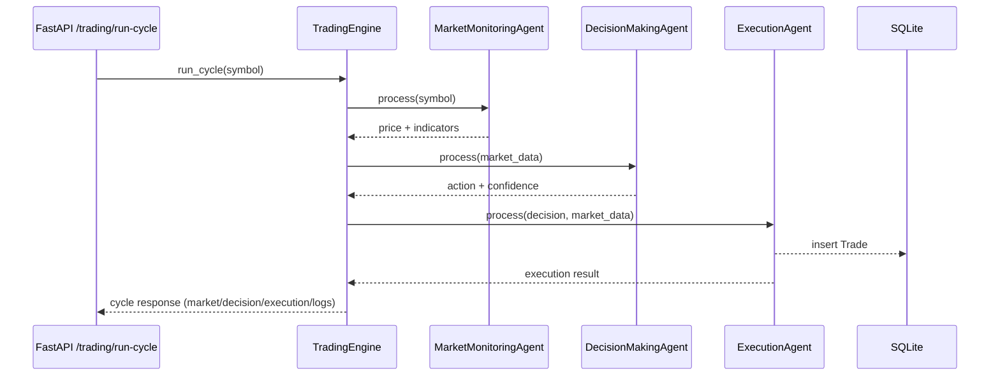

# Multi-Agent Trading System Documentation

## Project Overview
- Backend for a simulated multi-agent automated trading system built with FastAPI, SQLAlchemy, and scikit-learn.
- Uses Binance public REST API for live market data, trains/loads an ML model to predict BUY/SELL/HOLD, and simulates order execution into SQLite storage.

## Agents and Responsibilities
- **MarketMonitoringAgent (`app/agents/market_monitor.py`)**
  - Fetches latest price and recent klines from Binance via `BinanceMarketDataClient`.
  - Derives features: SMA(10), SMA(50), RSI(14), 1m price change, current price; returns raw klines sample.
- **DecisionMakingAgent (`app/agents/decision_maker.py`)**
  - Receives features; calls `ml/model_inference.predict_action`.
  - Returns action, confidence, and reason based on the trained RandomForest model.
- **ExecutionAgent (`app/agents/execution_agent.py`)**
  - Simulates order execution with slippage/filters (confidence gate, HOLD skip).
  - Persists trades to SQLite via SQLAlchemy model `Trade`.

## Communication Flow
- Coordination handled by `TradingEngine` (`app/services/trading_engine.py`).
- Sequence per cycle: MarketMonitoringAgent → DecisionMakingAgent → ExecutionAgent.
- Data passed as structured dicts; logs collected for observability.
- Exposed through FastAPI routes in `app/api/routes_trading.py`.

### High-Level Sequence


## System Components
- **FastAPI app (`app/main.py`)**: lifecycle loads/trains ML model, sets CORS, mounts trading router, exposes `/health`.
- **Config (`app/config.py`)**: env-driven settings (Binance URLs, symbols, model paths, DB URL, logging).
- **Services**
  - `BinanceMarketDataClient`: async httpx client for `/api/v3/ticker/price` and `/api/v3/klines`.
  - `TradingEngine`: orchestrates agents, tracks `cycle_id`, composes response DTO.
- **ML**
  - `model_loader.py`: prepares features from klines, creates pseudo-labels, trains RandomForest, saves/loads pickle with scaler.
  - `model_inference.py`: initializes shared loader, scales features, maps predictions to actions with reasons.
- **Data Layer**
  - `db_models/db.py`: SQLAlchemy engine/session factory.
  - `trade_entity.py`: `Trade` ORM model.
  - `schemas.py`: Pydantic response schemas for API.
- **API (`app/api/routes_trading.py`)**
  - POST `/trading/run-cycle`: run full loop.
  - GET `/trading/trades`: list recent simulated trades.
  - GET `/trading/market/latest`: fetch latest market snapshot + indicators.

## How the System Works (Execution Path)
1. **Startup**
   - FastAPI lifespan creates DB tables.
   - Attempts to load model from `MODEL_PATH`; if missing/invalid, pulls ~500 klines from Binance, trains RandomForest, saves if path provided.
   - Initializes global inference context.
2. **Run Cycle**
   - Market agent fetches price/klines → computes indicators.
   - Decision agent predicts action with confidence/reason.
   - Execution agent applies simple risk checks (HOLD/confidence) → simulates fill, writes `Trade`.
   - Engine returns aggregated payload with logs and timestamps.
3. **Data/Storage**
   - Trades persisted in SQLite (`trading.db` or configured DB).
   - Models stored under `models/` when `MODEL_PATH` is set (default `models/trading_model.pkl` in Docker).

## Running the Project
### Prerequisites
- Python 3.10+ (3.11 used in Dockerfile).
- pip or poetry; internet access to Binance public API.

### Local (pip)
```bash
pip install -r requirements.txt
uvicorn app.main:app --reload --host 0.0.0.0 --port 8000
```
- API docs: `http://localhost:8000/docs`
- Health: `http://localhost:8000/health`

### Docker
```bash
docker compose up --build
```
- Binds port `8000:8000`; mounts `trading.db` and `models/` for persistence.

### Configuration
- Via `.env` or env vars:
  - `BINANCE_BASE_URL` (default `https://api.binance.com`)
  - `DEFAULT_SYMBOL` (default `BTCUSDT`)
  - `DEFAULT_INTERVAL` (default `1m`)
  - `DEFAULT_KLINES_LIMIT` (default `100`)
  - `MODEL_THRESHOLD_PERCENT` (default `0.5`)
  - `MODEL_PATH` (e.g., `models/trading_model.pkl`)
  - `DATABASE_URL` (default `sqlite:///./trading.db`)
  - `LOG_LEVEL` (default `INFO`)

### Quick Use Cases
- Run a cycle: POST `/trading/run-cycle?symbol=BTCUSDT`
- List trades: GET `/trading/trades?limit=20`
- Latest market: GET `/trading/market/latest?symbol=ETHUSDT`

## Notes & Assumptions
- Uses only Binance public endpoints; no real orders are sent.
- Execution is simulated with simple slippage and confidence gating.
- Model auto-trains on startup if no valid pickle is present.
- SQLite default; switch to another DB by adjusting `DATABASE_URL`.

