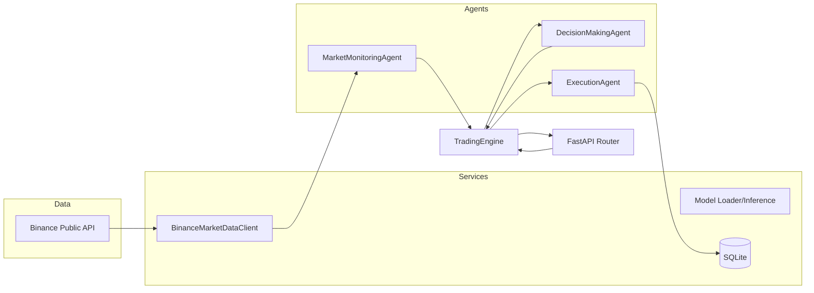

# Coordination and Communication Protocols for Multi-Agent Financial AI Systems in Automated Trading

## Cover Page
- Project: Multi-Agent Financial AI Trading Backend
- Date: 2025-12-08
- Stack: FastAPI, SQLAlchemy (SQLite), httpx, scikit-learn, Binance public API

## Abstract
Backend prototype of an automated trading system built as three collaborating agents (market monitoring, ML decision, execution simulator). The system consumes live Binance data, trains or loads an ML model for BUY/SELL/HOLD, simulates execution with persistence to SQLite, and exposes REST endpoints for a Flutter frontend. Emphasis is on clear agent separation, sequential coordination, and inspectable logs.

## Introduction & Problem
Automated trading needs modular components that can ingest live data, make ML-driven decisions, and execute orders safely. The goal: design a pedagogical backend that demonstrates coordination/communication across agents while avoiding real capital risk.

## Background / Related Work
- **Multi-agent trading**: common in research/academic demos to separate sensing, decision, and actuation.
- **Public market data**: Binance REST API is widely used for prototyping; no auth required for price/klines.
- **ML for signals**: Classical models (RandomForest/LogReg) on technical indicators remain standard baselines for fast prototyping before deep models.

## System Design
- **Agents**
  - MarketMonitoringAgent: fetches price/klines, computes SMA/RSI/price change.
  - DecisionMakingAgent: runs `predict_action` (RandomForest + scaler) over ordered feature vector; emits action, confidence, reason.
  - ExecutionAgent: simulates fills with slippage/confidence gating; writes `Trade` rows.
- **Coordinator**: `TradingEngine` sequences agents, aggregates logs, timestamps, and response DTO for API.
- **APIs**: FastAPI router exposes `/trading/run-cycle`, `/trading/trades`, `/trading/market/latest`, `/health`.
- **Persistence**: SQLite via SQLAlchemy; trades table holds simulated executions.
- **Configuration**: `.env`/env vars feed `app/config.py` (symbols, intervals, model path, DB URL, logging).

### Architecture Diagram

## Build & Implementation
- **Data ingestion**: `BinanceMarketDataClient` (httpx async) hits `/api/v3/ticker/price` and `/api/v3/klines`.
- **Feature engineering**: SMA(10/50), RSI(14), 1m price change, volume/current price derived per cycle and in training.
- **Model training/loading**: `ModelLoader` prepares features, creates pseudo-labels from forward SMA deltas, trains RandomForest with StandardScaler; persists pickle `{model, scaler}`.
- **Inference**: `predict_action` scales ordered features, maps class → BUY/SELL/HOLD, adds human-readable reasons.
- **Execution simulation**: Confidence filter (<0.6 → REJECTED; HOLD → SKIPPED); slippage ±0.01% applied.
- **API layer**: Pydantic schemas wrap the cycle response; DB sessions injected via dependency.
- **Lifecycle**: FastAPI lifespan creates tables, loads or trains model, initializes inference context.

## Results / What Happened
- Endpoints operational for running trading cycles, listing stored trades, and fetching current market snapshots.
- Model auto-trains on startup when no valid pickle exists; synthetic fallback ensures 3 classes for inference stability.
- Execution writes persistent simulated trades to `trading.db`; logs summarize each stage.

## What Worked & What Didn’t
- **Worked**
  - Clear sequential orchestration market → decision → execution.
  - Async data fetch with httpx; straightforward FastAPI wiring.
  - Automatic model training/loading with resilience to missing/degenerate models.
  - Persistence of simulated trades and structured API responses for frontend use.
- **Didn’t / Limitations**
  - No real order routing; execution is purely simulated.
  - Model quality depends on limited klines and simple technical features; no hyperparameter search.
  - No robust retry/backoff or circuit breaking around Binance; minimal error handling.
  - No authentication/authorization on the API; suitable only for internal/demo use.

## Conclusion & Future Ideas
- Demonstrated a minimal, inspectable multi-agent trading backend with ML-driven decisions and simulated execution.
- Future improvements:
  - Enrich features (order book depth, multi-timeframe indicators) and try gradient boosting/temporal models.
  - Add resilience (retry/backoff, caching, rate-limit handling) for data ingestion.
  - Introduce risk management layer (position sizing, stop-loss/take-profit simulation).
  - Add auth and role-based access for production-like environments.
  - Expand tests with mocked Binance and deterministic model fixtures.

## References
- Binance REST API docs: https://binance-docs.github.io/apidocs/spot/en/
- FastAPI docs: https://fastapi.tiangolo.com/
- scikit-learn docs: https://scikit-learn.org/

## Extra Materials
- Key code paths: `app/services/trading_engine.py`, `app/agents/*.py`, `app/ml/*`, `app/api/routes_trading.py`.
- Model artifact location (when saved): `models/trading_model.pkl`.
- Database artifact: `trading.db` (simulated trades).

